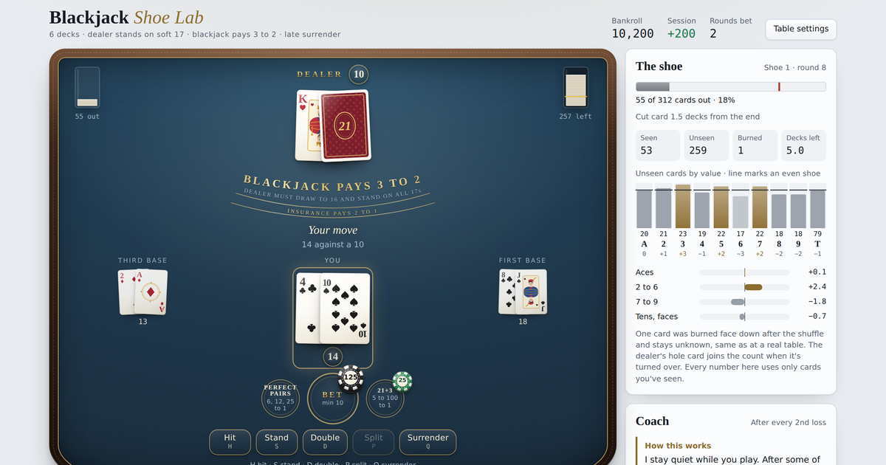
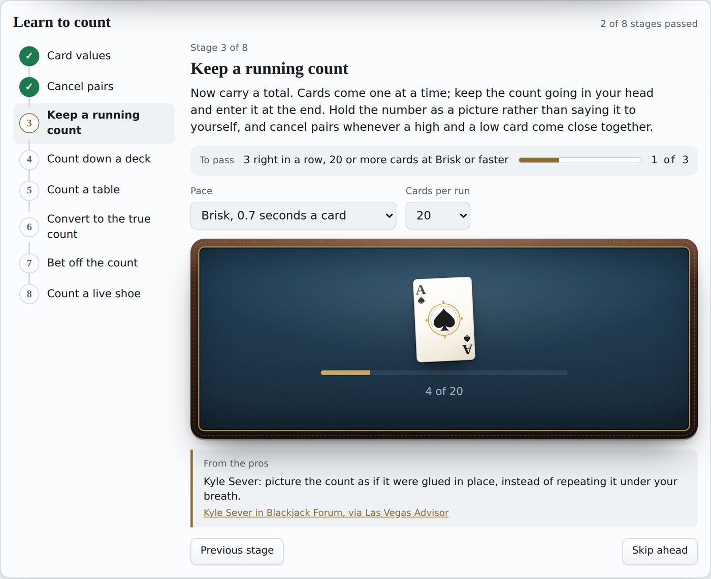
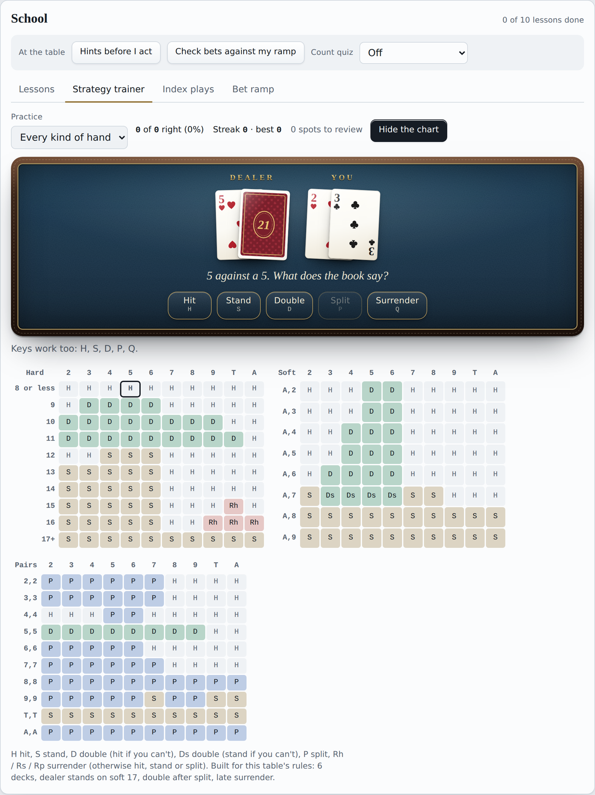

# Blackjack Shoe Lab

A blackjack trainer that runs in your browser. Play a six-deck shoe against the dealer, learn basic strategy, and learn to count cards with Hi-Lo. Every edge in the app is worked out exactly from the cards still in the shoe.

### [Play it now](https://purplehater.github.io/blackjack-shoe-lab/)

## What's in it

**A real table.** A six-deck shoe with a cut card and a burn card, and up to two other players who play by the book. You get insurance, doubles, splits up to four hands, late surrender, and the Perfect Pairs and 21+3 side bets. You can change the rules: number of decks, soft 17, 3 to 2 or 6 to 5, double after split, surrender and penetration.

**Learn to count.** An eight-stage course that starts with card values and ends with counting a live shoe. On the way: cancelling pairs, keeping a running count, counting down a deck against the clock, counting a full table of hands, converting to the true count, and betting off the count. Each stage has a clear pass mark.

**School.** Ten lessons, from the table rules to playing in a real casino. There's also a basic strategy trainer with the full chart for your rules, flashcards for the Illustrious 18 and Fab 4 index plays, and a bet ramp calculator with risk of ruin.

**Coach.** After a losing round it looks back at your bet and your plays and tells you what it would change. It works from the cards that were actually left in the shoe.

**Edge lab.** The live edge of every bet and every play, card removal effects, a count builder that plots your count against the real edge, and session stats that separate skill from luck.

## How the numbers work

The odds are composition-dependent: they come from the exact cards left in the shoe, not from a fixed table. With six decks, dealer standing on soft 17, double after split and late surrender, basic strategy comes out at a 0.33% house edge, in line with published figures.

## Run it yourself

It's one HTML file with no build step and nothing to install. Download `index.html` and open it in any modern browser. Progress in the lessons and drills is saved in your browser.

## Sources

The strategy and counting material draws on the Wizard of Odds, Blackjack Apprenticeship, Las Vegas Advisor and others. Every tip in the app links to its source.

## Disclaimer

For learning and practice. No real money is involved. Card counting is legal in most places, but casinos can refuse to let counters play.

## License

[MIT](LICENSE)
